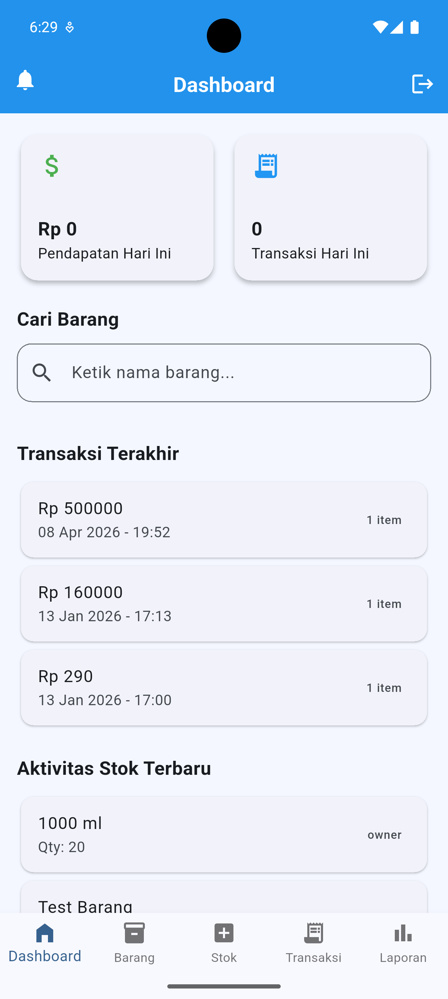
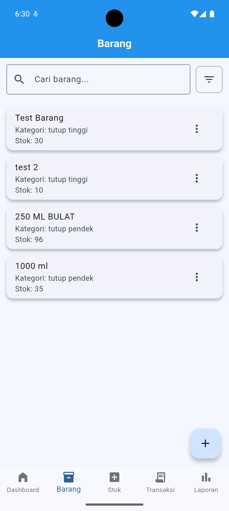
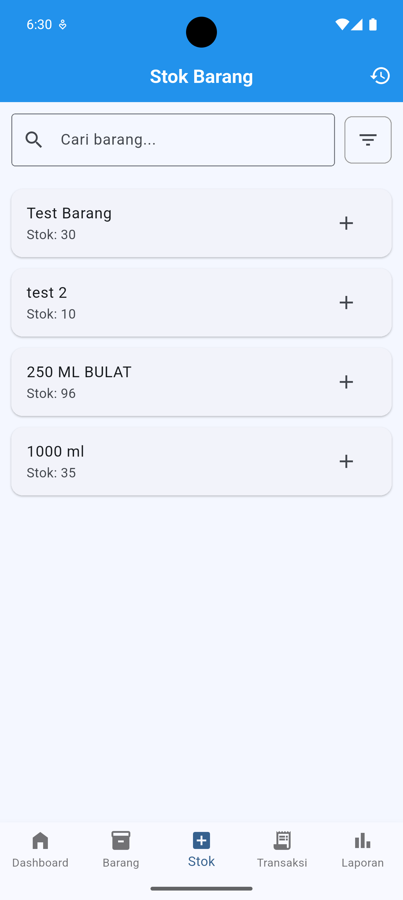
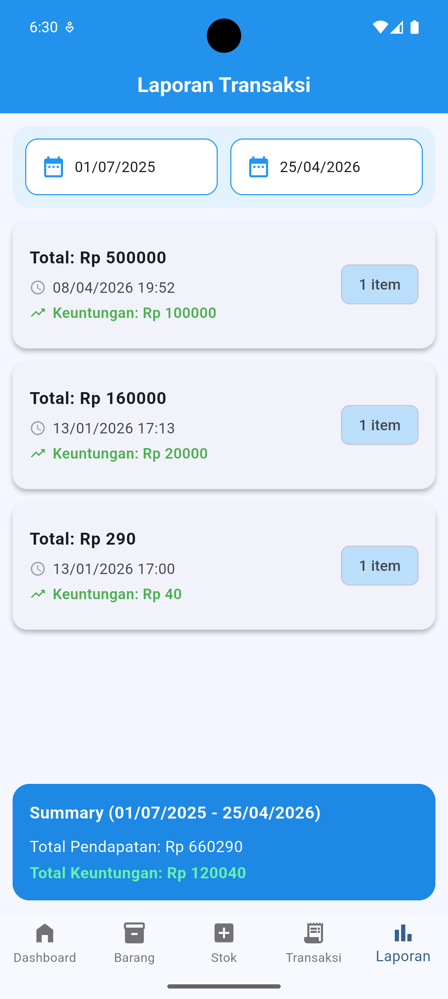

# 📦 Aplikasi Manajemen Inventaris Toko Botol Plastik

[](https://flutter.dev)
[](https://dart.dev)
[](https://developer.android.com)

## 📖 Tentang Proyek

Aplikasi Manajemen Inventaris Toko Botol Plastik merupakan aplikasi berbasis Android yang dikembangkan menggunakan Flutter sebagai bagian dari penelitian skripsi.

Aplikasi ini dirancang untuk membantu proses pengelolaan inventaris barang pada toko botol plastik, mulai dari pencatatan data barang, pengelolaan stok masuk dan keluar, hingga penyajian laporan inventaris secara digital.

Dengan adanya aplikasi ini, proses pengelolaan inventaris yang sebelumnya dilakukan secara manual dapat menjadi lebih efektif, efisien, dan terorganisir.

---

## 🎯 Tujuan Pengembangan

Tujuan dari pengembangan aplikasi ini adalah:

- Mempermudah pengelolaan data barang.
- Mempermudah pencatatan stok masuk dan stok keluar.
- Mengurangi risiko kesalahan pencatatan secara manual.
- Menyediakan informasi stok secara real-time.
- Membantu pemilik toko dalam proses pengambilan keputusan berdasarkan data inventaris.

---

## 📱 Tampilan Aplikasi

<p align="center">
  
  
  
</p>

<p align="center">
  
  
</p>

---

## ✨ Fitur Utama

### 👤 Manajemen Pengguna
- Login pengguna
- Pembagian hak akses berdasarkan peran pengguna

### 📦 Manajemen Barang
- Menambah data barang
- Mengubah data barang
- Menghapus data barang
- Melihat daftar barang

### 🔎 Pencarian Barang
- Mencari barang
- Melihat informasi barang

### 📊 Manajemen Stok
- Pencatatan stok masuk
- Pencatatan stok keluar
- Monitoring jumlah stok barang

### 📋 Riwayat Aktivitas
- Penyimpanan riwayat perubahan stok
- Pelacakan aktivitas inventaris

### 📈 Laporan Inventaris
- Ringkasan data inventaris
- Statistik stok barang
- Informasi barang dengan stok rendah

### 🔔 Notifikasi
- Notifikasi stok menipis
- Notifikasi aktivitas inventaris

---

## 🏗️ Arsitektur Sistem

Aplikasi dikembangkan menggunakan pola arsitektur **MVVM (Model View ViewModel)** untuk memisahkan tampilan, logika bisnis, dan pengelolaan data.

```text
View
 │
 ▼
ViewModel
 │
 ▼
Service
 │
 ▼
Model
```

### Komponen Arsitektur

**Model**
- Merepresentasikan struktur data aplikasi.

**View**
- Menampilkan antarmuka pengguna.

**ViewModel**
- Mengelola state dan logika bisnis aplikasi.

**Service**
- Menangani komunikasi dengan Firebase.

---

## 🛠️ Teknologi yang Digunakan

### Framework
- Flutter
- Dart

### State Management
- Provider

### Backend
- Firebase Authentication
- Cloud Firestore
- Firebase Storage

### Notifikasi
- Firebase Cloud Messaging
- Flutter Local Notifications

---

## 📂 Struktur Folder

```text
lib/
├── models/
├── services/
├── viewmodels/
├── views/
├── app.dart
├── auth_gate.dart
├── firebase_options.dart
└── main.dart
```

---

## 📋 Kebutuhan Sistem

### Perangkat Pengembang

- Flutter SDK >= 3.0
- Dart SDK >= 3.0
- Android Studio
- Firebase Project

### Perangkat Pengguna

- Android 5.0 (API Level 21) atau lebih tinggi

---

## 🚀 Instalasi

### Clone Repository

```bash
git clone https://github.com/username/manajemen_inventaris.git
```

### Masuk ke Folder Project

```bash
cd manajemen_inventaris
```

### Install Dependency

```bash
flutter pub get
```

### Konfigurasi Firebase

```bash
flutterfire configure
```

### Menjalankan Aplikasi

```bash
flutter run
```

---

## 🧪 Pengujian

Menjalankan seluruh pengujian:

```bash
flutter test
```

Analisis kode:

```bash
flutter analyze
```

---

## 📦 Build APK

```bash
flutter build apk --release
```

File APK hasil build:

```text
build/app/outputs/flutter-apk/app-release.apk
```

---

## 📄 Lisensi

Proyek ini dibuat untuk keperluan penelitian dan pengembangan akademik.